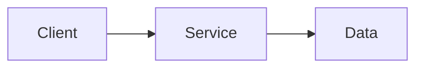

# johnmcdougal.com

Personal site and blog for John McDougal — Sacramento-based IT Consultant, Homelabber, and chronic pattern-finder.

**Live:** [johnmcdougal.com](https://johnmcdougal.com)

---

## About this project

Built in public. This is the source for my personal site — a place to document what I'm building, thinking, and learning across IT, homelabbing, cybersecurity, and knowledge work.

The stack is deliberately boring in the best way: static files, no client-side framework, fast everywhere. Content lives in Markdown and MDX. Deploys automatically on every push via Cloudflare Pages.

## Stack

- **[Astro 7](https://astro.build)** — static site generator
- **[Cloudflare Pages](https://pages.cloudflare.com)** — hosting + CDN + deploy pipeline
- **Markdown / MDX** — all content authored here
- **Custom CSS** — three-theme system (light / dark / true black OLED), teal accent (`#14b8a6`)

## Project structure

```
src/
├── components/       # Header, Footer, BaseHead, etc.
├── content/
│   ├── blog/         # Blog posts (.md / .mdx)
│   └── projects/     # Project entries (.md / .mdx)
├── layouts/          # Page layouts
├── pages/            # Routes (index, about, blog, projects, tags)
└── styles/
    └── global.css    # Entire theme system lives here
public/
├── robots.txt        # AI crawler governance
└── llms.txt          # Machine-readable site inventory for LLMs
```

## Local development

> **Note:** Run install and dev/build commands from a local directory that is **not** inside a cloud-synced folder (Google Drive, OneDrive, etc.). Synced folders cause file-lock errors with `node_modules`. Keep source in your synced folder for backup; clone or copy to a local path for building.

Expected local runtime:

- Node `24.19.0` (`.nvmrc`)
- npm `12.0.2`
- clean install path: `npm ci`

| Command                 | Action                                                           |
| :---------------------- | :--------------------------------------------------------------- |
| `npm ci`                | Install exactly from `package-lock.json`                         |
| `npm run dev`           | Start local dev server at `localhost:4321`                       |
| `npm run check`         | Run Astro content and type checks                                |
| `npm run verify-build:sync-baseline` | Rebuild and auto-sync `scripts/verify-build.mjs` expectation baselines |
| `npm run whitespace:fix-staged` | Trim trailing whitespace in staged text files and re-stage them |
| `npm run build`         | Build production site to `./dist/`                               |
| `npm run commit:check`  | Verify the explicit staged scope and run canonical validation     |
| `npm run hooks:status`  | Report the effective Git hooks path and configuration origin      |
| `npm run hooks:install` | Opt in to the repository-local tracked pre-commit hook            |
| `npm run verify:build`  | Verify selected generated-site invariants in `./dist/`           |
| `npm run validate`      | Run whitespace check, Astro check, fresh build, and verification |
| `npm run review`        | Validate, refresh, and leave a local preview server running      |
| `npm run review:status` | Report repository, build, and owned preview-server state         |
| `npm run review:stop`   | Stop only the script-owned preview server                        |

The review server binds to `127.0.0.1` by default and writes ignored state/logs under `.tmp/`. When human testing is complete, stop it with `npm run review:stop` before committing unless the active packet gives different closure instructions.

## Content addition guide

### Standalone blog post

1. Copy `src/content/blog/_template-blog.md` to `src/content/blog/<lowercase-kebab-case-slug>.md`. The filename determines the URL; `title` is only the displayed heading. Uppercase and spaces are normalized for route checks, but use a stable lowercase filename with letters, numbers, and hyphens.
2. Fill in `title`, `description`, `pubDate` (`YYYY-MM-DD`), and `tags`. The template includes every blog frontmatter field: uncomment optional `updatedDate`, `heroImage`, and `projectRef` as needed. For a series post, uncomment both `series` and `seriesPart`.
3. Run `npm run check` to validate content and types. Use `npm run review` if you want a validated local preview.
4. Stage the new post and any other intended content edits: `git add -- src/content/blog/<your-slug>.md`.
5. Run `npm run verify-build:sync-baseline`. It rebuilds the site, updates the generated-output expectations in `scripts/verify-build.mjs`, and stages that file automatically. You do not need to edit baseline counts or hashes by hand. The pre-commit hook repeats this step automatically.
6. Review `git status --short` and `git diff --cached`, then run `npm run commit:check`. Stage all intended changes and resolve unrelated unstaged or untracked files if the check refuses the snapshot.
7. Commit after the check passes. The pre-commit hook syncs the baseline, fixes staged trailing whitespace, and runs the commit check again. Push only after the commit succeeds.

For projects, copy `src/content/projects/_template-project.md`; set `updatedDate` only when intentionally updating project state. Run the same check, staging, baseline-sync, and commit steps above.

### Mermaid diagrams

Write diagrams directly in blog or project Markdown/MDX bodies with a `mermaid` fenced code block. Mermaid is bundled locally and loaded only for pages that contain a Mermaid fence. The original fence remains in the page source; after successful rendering, readers can expand it with “View diagram source.” If JavaScript is disabled or a diagram has invalid syntax, the readable code fence remains visible. Add `accTitle` and `accDescr` inside diagrams, and explain the diagram's key point in the surrounding prose. The Mermaid runtime uses strict security settings; diagram-authored configuration cannot loosen them. Theme colors follow the site's light, dark, and OLED modes.



Run `npm run check` and `npm run review`, then inspect the diagram in all themes and at mobile width. Check that the source fallback remains useful and that raw blog Markdown still contains the Mermaid fence. Mermaid uses Dagre as the site-wide default layout to avoid fetching ELK for ordinary diagrams; the source definition remains portable to Mermaid-aware tools. Mermaid code fences are not site graph nodes or relationships; the site graph continues to use content tags and `projectRef` metadata.

`npm run verify:build` also reports source tags that would normalize to different canonical values (case, spaces, or duplicates). Warnings are non-blocking by default; set `VERIFY_BUILD_STRICT_TAG_LINT=1` to make them fail validation.

### Session automation summary

- Pre-commit now runs baseline sync and staged whitespace normalization before commit validation.
- Baseline sync rewrites `scripts/verify-build.mjs` expectations from current content and generated output.
- Content schema now normalizes tags at ingest (trim, lowercase, spaces to hyphens, dedupe), which prevents casing/spacing route drift.
- Verify-build now checks latest related project activity dynamically from content relationships instead of hardcoded post IDs.

Commit workflow:

1. Stage only the approved paths and inspect `git diff --cached`.
2. Keep the nonignored worktree free of unstaged and untracked changes so validation reads the proposed commit state.
3. Run `npm run commit:check`; it reports staged names/stat, checks the staged diff, and invokes `npm run validate` without rewriting or staging files.
4. Install the convenience hook with `npm run hooks:install` only after `npm run hooks:status` reports no conflict. The script is canonical; the hook only calls it.
5. On the hook's first Git-for-Windows commit, preserve its executable mode with `git add --chmod=+x .githooks/pre-commit`; later commits retain mode `100755`.
6. Correct failures explicitly, stage the intended versions again, and rerun the check. A `--no-verify` bypass must be disclosed in closure evidence.
7. Commit only after human authorization. These commands never add, commit, merge, or push.

Validation policy:

1. Run deterministic checks first with `npm run validate`.
2. Use generated output and HTTP checks for route behavior.
3. Use the persistent localhost review server for human visual review.
4. Do not use the known failing in-app/sandbox browser path as an acceptance gate.
5. Do not install Playwright or browser binaries during normal implementation packets.
6. Use a known-working host browser only when a packet explicitly requires browser rendering.

Branch and release policy:

- Keep feature work local until localhost validation and human review pass.
- Do not commit, push, merge, reset, or discard changes without explicit authorization.
- Treat body-copy word counts as diagnostics only; fit, evidence, truth boundaries, and reader comprehension govern narrative copy.
- Generated directories (`dist/`, `.astro/`, `.tmp/`) and local environment files are not source changes.

Cloudflare Pages deploys automatically on every push to `main`.

## Future: self-hosting path

The site builds to pure static files in `dist/` — portable to any host. To move off Cloudflare Pages:
1. Point an A record at your VPS IP
2. Serve `dist/` with nginx or Caddy + Let's Encrypt
3. Set up a CI step to build and rsync on push

No site code changes required.

## Related

- [GitHub profile](https://github.com/GrandDay)
- [LinkedIn](https://www.linkedin.com/in/john-mcdougal-012a02370/)
