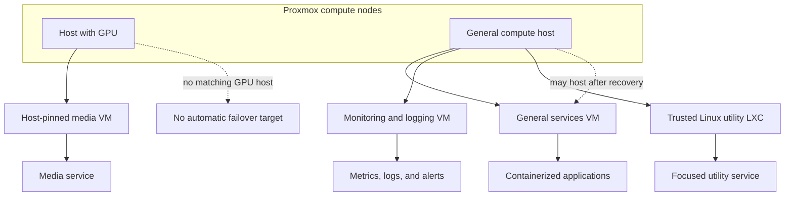
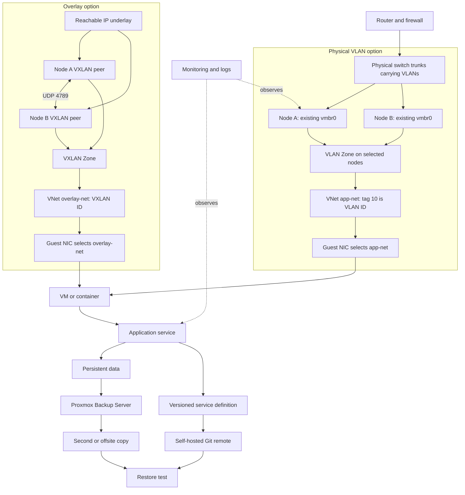

> **TL;DR:** Proxmox gives a home lab a shared control plane; useful layering comes from deciding which host, guest, network, and recovery boundary each service actually needs.

A homelab rarely starts with a matching rack of servers and a finished architecture. More often, it grows from a spare desktop, a secondhand mini PC, a disk shelf, and the services you want to try next. Proxmox helps make that uneven pile of compute feel like one environment, but the useful part is not the cluster checkbox. It is being able to decide where work belongs, what it depends on, and how you would bring it back.

This is a pattern I find useful when thinking about a Proxmox lab. It is not a map of my current environment, and it is not a prescription that every service needs its own VM, VLAN, or high-availability pair.

## Start with the host and its storage

A Proxmox node contributes processors, memory, network interfaces, and some combination of local or shared storage. I like to keep the host's boot and system storage separate from the storage I assign to guests when the hardware allows it. In a smaller lab, that separation may be a layout on the same disks rather than physically separate devices. Either can work; the important thing is to know what shares a failure when a disk, controller, or host goes away.

Guest disks might live on LVM-thin, a directory-backed store, ZFS, or storage reachable over the network. ZFS can be a good fit when its integrity checks, snapshots, and replication are useful to you. It also asks you to understand pools, disk layouts, memory use, and how each node will be maintained. ZFS replication can help keep a guest's data available for a planned recovery or migration workflow, but it is not shared storage and it does not by itself provide live migration. Shared storage, local storage, CPU compatibility, network capacity, and guest device mappings all change what moves cleanly between nodes.

That is the first useful boundary: what belongs to the host, what is allocated to a guest, and what data has a recovery path independent of either.

## Place guests by role and failure domain

A VM or container is a boundary you can assign CPU and memory to, back up, restore, update, and connect to selected networks. Use that boundary where it helps. A utility that is easy to rebuild may fit alongside similar services. A database, a security boundary, or a workload with special hardware may deserve a separate guest. One VM per application is not a rule; neither is putting everything in one large guest.

An LXC container is another option when the workload fits. It is lighter than a VM, but it is not a small VM: it runs against the Proxmox host's Linux kernel. That means choosing LXC is also choosing to share that kernel boundary, with the compatibility and isolation tradeoffs that come with it. For a trusted Linux service or a tightly related stack, an LXC can make sense, particularly on a node whose scope is already dedicated to those workloads and whose configuration and recovery path are protected. If the workload needs its own kernel, stronger separation, unusual device access, or a more portable restore target, a VM may be the better boundary. Neither choice is universally right.

Host-specific devices make the tradeoff visible. A media VM using GPU passthrough may need to stay on a particular node. If only one node has a compatible GPU, that workload has no equivalent failover target. You can still back it up and document how to restore it, but high availability is not created by calling it a cluster. Device mapping and recovery may be more work than the service is worth for a home lab.

For less specialized workloads, I tend to group by role or failure domain: general application services, infrastructure tools, and monitoring or logging are possible starting points. The boundaries should follow how you want to secure, maintain, and recover them, not a diagram that looks enterprise enough.

The picture is intentionally uneven. One role has a hardware constraint; the others can be placed where capacity and recovery plans allow. Proxmox's cluster-wide view and API make those placements easier to manage, but the actual availability still comes from compatible resources, quorum, storage, network design, and tested recovery.

## Put services inside a useful boundary

Inside a general-purpose services VM, Docker or Podman can give applications their own runtime boundaries without turning every small service into a separate guest. A home page, a network calculator, CyberChef, or other tools might live together if their data, access, and maintenance needs fit. Monitoring and logging may deserve a separate guest if you want visibility to survive an application-host failure.

Once service definitions live in version control, the hypervisor is only one layer of automation. A self-hosted Forgejo or Gitea instance can hold deployment repositories and mirrors. A platform such as Dokploy can use a repository and branch as a deployment source, then use a webhook to redeploy on an approved push. OpenTofu and Ansible can manage infrastructure and configuration around that service layer. The same pattern works with other tools; the point is to make desired state reviewable and repeatable.

## Layer network access and recovery

The physical switch and router carry the network's real VLANs and inter-VLAN policy. For a simple setup, a Linux bridge can connect guest interfaces to a physical network, with VLAN-aware bridge settings and switch trunks where tagged networks are needed. Proxmox SDN adds a Zone and one or more VNets when a cluster-wide guest-facing network is useful: a Zone selects the networking technology and participating nodes, and a VNet belongs to that Zone and is what I attach to a guest NIC.

With a VLAN Zone, each participating node uses an existing Linux or OVS bridge connected to the physical network. The switch ports carry the tagged VLANs, and the VNet's tag is the VLAN ID. After the SDN configuration is applied across the cluster, I select that VNet as the guest NIC's bridge; I do not add a second VLAN-to-VXLAN mapping step. A VXLAN Zone is a different choice: it builds a Layer 2 overlay across reachable IP peers, using UDP port 4789 by default. Its VNets use VXLAN IDs, and the encapsulation overhead needs to be included in the underlay MTU. VXLAN is useful when that overlay solves a real placement or network requirement, not as a synonym for a VLAN-backed VNet.

Think about firewall policy at each boundary. A central router or firewall can govern traffic between VLANs, Proxmox can apply host or guest rules, and a guest can restrict its own services. These layers should reinforce a clear policy rather than duplicate rules nobody knows how to debug. A fully virtualized lab can also create an isolated network with one deliberate gateway to the physical network, if that fits the experiment.

Backups and monitoring cross all of these boundaries. Proxmox Backup Server can protect guests on a schedule that reflects how much data and downtime you can tolerate. A second or offsite copy protects against failures that affect the primary backup store. Versioned configuration protects the recipe, not just the running machine. Restore tests tell you whether both paths work.

That gives you a few independent questions to ask: can I move or rebuild this guest, can it reach only what it should, and can I recover its state if the host or storage disappears? The answers do not need to be the same for every workload.

Proxmox makes it practical to build a coherent lab from unlike machines without pretending those machines have identical capabilities. Layering is how I keep that flexibility understandable: place work according to its dependencies and failure domain, then make the network, data, and recovery paths explicit. Some services can be cattle; some hardware-bound guests are pets for a while. The goal is knowing which is which and having a workable next move when something breaks.

---

*Which boundary in your lab would make the next rebuild or failure easier to manage?*