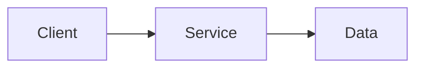

*[One-line tagline. Optional but sets the tone.]*

## What this is

[1-2 plain sentences. No assumed context. What does it do or solve?]

## Why it exists

[The actual motivation. This is where voice lives.]

## Current state

[What exists and works right now. Present tense, honest.]

## What I am figuring out

[Open questions, active threads. This IS the content -- not a gap.]

<!-- Optional diagram: include a prose explanation, then add a Mermaid fence with accessible labels. -->
<!--

-->

<!--
## Sources
- [Source name](url) -- brief note on why it is referenced
-->