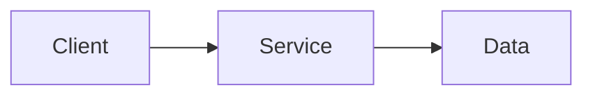

*[One-line tagline. Optional but sets the tone.]*

## What this is

[1-2 plain sentences. No assumed context. What does it do or solve?]

## Why it exists

[The actual motivation. This is where voice lives.]

## Current state

[What exists and works right now. Present tense, honest.]

## What I am figuring out

[Open questions, active threads. This IS the content -- not a gap.]

<!-- Optional diagram: explain it in prose, then add a Mermaid fence with accTitle/accDescr. It renders at natural size with scrolling, opt-in Pan mode, and a full-size viewer; colors follow the site's light, dark, and OLED themes. -->
<!--

-->

<!-- VS Code snippets: mermaid-flowchart and mermaid-sequence. Rendering is automatic on any project page with a Mermaid fence; source remains available if rendering fails or JavaScript is disabled. -->

<!--
## Sources
- [Source name](url) -- brief note on why it is referenced
-->